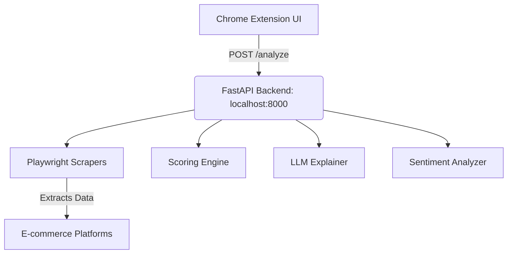

# 🛒 ClarityCart — AI-Powered Universal E-commerce Shopping Assistant

> **Note: This project is currently in the active development phase. We are continuously pushing updates and expanding support for various e-commerce platforms.**

Find the **single best product** across e-commerce platforms using deterministic scoring, AI explanations, and sentiment analysis. Requires **zero technical knowledge**—just speak naturally. Runs blazingly fast on the **Cloud** to save device power, with a strict **100% Local Fallback option** for absolute privacy.

---

## 🌌 The Interface (New!)
ClarityCart features a stunning, premium **anti-gravity dark mode UI**. It mimics a 2035 AI operating system complete with:
- Animated SVG wave & particle backgrounds
- Glassmorphism frosted panels
- Glowing neon accents & magnetic micro-interactions

---

## ✨ Features

| Feature | Description |
|---------|-------------|
| 🔍 **Zero-Tech Search** | Natural language input — just type what you need (e.g., "laptop for my mom"), no specs needed! |
| 🌐 **Universal Architecture** | Extensible scraping workers designed to support any e-commerce site (Amazon, Flipkart, Myntra, etc.). |
| ⚡ **Deterministic Scoring** | Advanced weighted formula considering ratings, reviews, price, and offers. |
| 🏷️ **Sponsored Penalization** | Automatically detects and penalizes sponsored or promoted listings to prioritize organic results. |
| 🤖 **AI Explanation** | Explains exactly "Why this product?" based on your specific lifestyle needs. |
| 📊 **Deep Background Checks** | Scrapes real user discussions from forums like Reddit and Twitter to find long-term flaws. |
| 🛒 **Autonomous Order Agent** | The AI can physically click "Add to Cart" and navigate the checkout flow for you. |
| ☁️ **Cloud + Local Flexibility** | Balances resource efficiency (Cloud) with absolute data privacy (Local/llama.cpp). |

---

## 🔮 Future Roadmap

- 📸 **Visual / Image Search:** Upload a picture of an item to automatically scan the web and find the exact or closest match.
- 🎙️ **Voice Mode:** Completely hands-free operation: *"Clarity, find me those blue shoes I liked yesterday."*
- 📉 **Price Tracking & Prediction:** AI-driven advice on exactly *when* to buy for the lowest price.
- 🎟️ **Auto-Coupons:** Automatically scraping and applying promo codes during the agentic checkout phase.
- 🛍️ **Multi-Site Battle:** Scanning Amazon, Flipkart, and local retailers simultaneously to find the lowest price across the internet.

---

## 🏗️ Architecture

The project consists of a lightweight Chrome Extension frontend and a robust Python FastAPI backend, communicating locally.



### Components:
- **Chrome Extension UI**: A Manifest V3 extension providing a sleek, dark-mode popup interface for the user to enter queries and view recommendations.
- **FastAPI Backend**: The core engine coordinating scraping, scoring, and AI analysis.
- **Playwright Scrapers**: Modular web scrapers that navigate search results, extract product data, and handle pagination.
- **Scoring Engine**: Normalizes and ranks extracted products deterministically.
- **LLM Explainer**: Summarizes why the top product is recommended using a locally hosted LLM.

---

## 📁 Project Structure

```text
ClarityCart/
├── backend/
│   ├── main.py                     # FastAPI entry point & API routes
│   ├── config.py                   # Centralized configuration & constants
│   ├── requirements.txt            # Python dependencies
│   ├── scraper/                    # Modular scrapers for different platforms
│   │   ├── worker.py               # Base scraping logic
│   │   └── ...                     # Platform-specific workers
│   ├── scoring/                    # Deterministic ranking engine
│   ├── llm/                        # Local AI engine integration (llama.cpp/Ollama)
│   └── sentiment/                  # Sentiment analysis module (Reddit API, etc.)
├── extension/
│   ├── manifest.json               # Chrome Extension Manifest V3
│   ├── popup.html / .css / .js     # Extension UI and logic
│   ├── background.js               # Service worker for background tasks
│   ├── content_scripts/            # Scripts to interact with page DOMs
│   └── icons/                      # Assets
└── README.md
```

---

## 🚀 Quick Start (Development)

### Prerequisites
- Python 3.10+
- Google Chrome
- Local LLM Runner (e.g., [Ollama](https://ollama.com/download) or llama.cpp)

### 1. Set Up Local LLM
```powershell
# Example using Ollama
ollama pull deepseek-r1:7b  # Or any lightweight model like phi3:mini
```

### 2. Set Up Backend
```powershell
cd ClarityCart\backend
python -m venv venv
.\venv\Scripts\activate
pip install -r requirements.txt
playwright install chromium
```

### 3. Start Backend Server
```powershell
cd ClarityCart\backend
.\venv\Scripts\activate
uvicorn main:app --host 0.0.0.0 --port 8000 --reload
```

### 4. Load Chrome Extension
1. Open Chrome and navigate to `chrome://extensions/`
2. Enable **Developer mode** (top right toggle).
3. Click **Load unpacked**.
4. Select the `ClarityCart\extension\` directory.

### 5. Usage
1. Click the **ClarityCart** icon in your Chrome toolbar.
2. Enter your shopping query (e.g., "best wireless earbuds under 2000").
3. The extension will coordinate with the backend to scrape data, rank products, and provide a tailored AI recommendation.

---

## 🧮 Scoring Logic

The deterministic scoring algorithm ensures you get the best value. While specific weights may be tuned per platform, the general approach involves:
- **Rating Normalization**: Scales ratings to a consistent metric.
- **Review Log-Scaling**: Prevents products with millions of reviews from completely dominating well-rated newer products.
- **Price Relativity**: Favors competitive pricing within the extracted search results.
- **Promotional Bonuses**: Grants points for active offers and discounts.
- **Organic Preference**: Penalizes explicitly sponsored or heavily promoted items.

---

## 📡 Core API Endpoints

| Endpoint | Method | Description |
|----------|--------|-------------|
| `/health` | GET | Check backend and LLM readiness |
| `/analyze` | POST | Trigger the full scraping, scoring, and analysis pipeline |

### Expected Payload for `/analyze`
```json
{
  "query": "gaming mouse under 1500",
  "product_limit": 30,
  "reddit_check": true,
  "platform": "auto"
}
```

---

## 🔒 Privacy & Safety

- **Zero Cloud APIs**: All ML inference and data processing runs strictly on your local hardware.
- **No Telemetry**: ClarityCart does not track your search history or build advertising profiles.
- **Extensible & Open**: Built with transparency in mind, allowing you to audit the scraping and scoring logic.

---

## 📄 License

MIT
